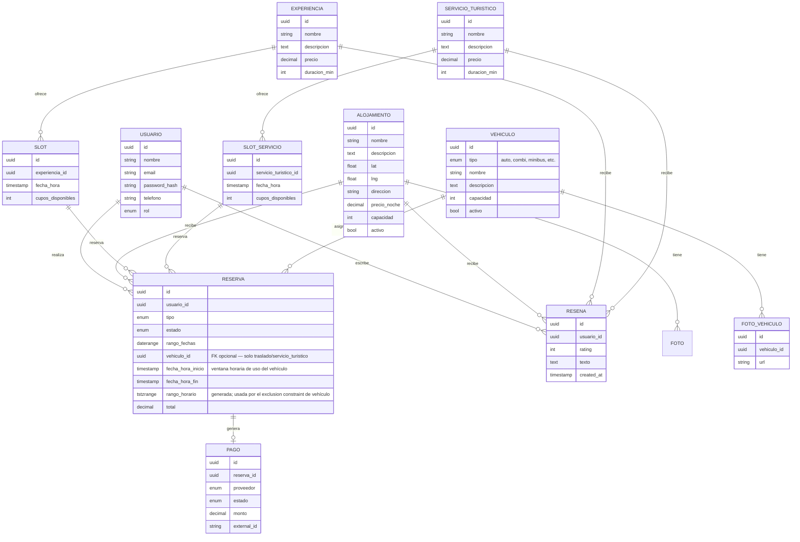
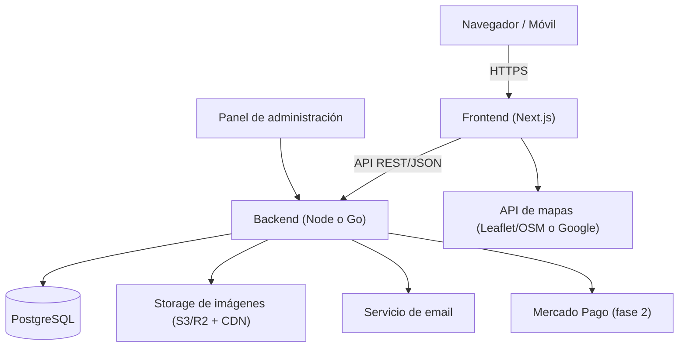

# Turismo Marcuzzi — Especificación del Proyecto

> Aplicación web de turismo para alquiler de departamentos, experiencias y traslados en **Puerto Madryn, Chubut, Argentina**.

---

## 1. Visión general

Turismo Marcuzzi es una plataforma web que ofrece cuatro servicios integrados para el turista que visita Puerto Madryn:

1. **Alojamiento** — alquiler de departamentos.
2. **Experiencias** — actividades turísticas simples y de corta duración (paseos por la playa, salidas de medio día).
3. **Servicio Turístico** — excursiones más complejas y de mayor duración (agregado 2026-08-11, aclaración del cliente; ver diferenciación en §4.3/§4.4).
4. **Traslados** — servicio de recogida/traslado desde y hacia el aeropuerto, con selección del vehículo entre la gama disponible (agregado 2026-08-11).

La propuesta de valor central es el **servicio personalizado y humano**, en contraste con plataformas masivas y automatizadas como Airbnb o Booking. El sitio debe transmitir cercanía, confianza y atención a medida.

### Diferenciador
Mientras que las grandes plataformas ofrecen catálogos impersonales, Turismo Marcuzzi acompaña al turista en toda su estadía: le consigue el departamento adecuado para su familia, le arma el cronograma de actividades y le resuelve la movilidad desde que baja del avión. Es un "todo en uno" con trato directo.

---

## 2. Público objetivo

- Familias y parejas que viajan a Puerto Madryn por turismo (ballenas, Península Valdés, pingüinos, playas).
- Turismo nacional e internacional (evaluar soporte **ES/EN**).
- Perfil que valora la atención personalizada por sobre la autogestión total.

---

## 3. Alcance

### MVP (primera versión)
- Landing atractiva con las tres categorías.
- Listado y detalle de departamentos (fotos, mapa, calendario de disponibilidad, descripción, reseñas).
- Listado y detalle de experiencias con reserva.
- Reserva de traslado al/desde aeropuerto.
- Registro/login de usuarios.
- Sistema de reservas con confirmación.
- Panel de administración para que el cliente gestione todo.

### Fuera del MVP (fases posteriores)
- Pagos online integrados (puede empezar con reserva + pago manual/seña).
- Chat en vivo / WhatsApp integrado.
- Programa de fidelización.
- App móvil nativa.
- Multi-idioma completo.

---

## 4. Funcionalidades por módulo

### 4.1 Home / Landing
- Hero a pantalla completa: nombre grande **"Turismo Marcuzzi"** sobre una foto de Puerto Madryn de fondo.
- Descripción breve que enfatice el **servicio personalizado** (el diferenciador vs. Airbnb).
- Las **cuatro categorías** debajo, cada una como tarjeta visual llamativa con imagen y descripción corta:
  - **Alojamiento** — *"Encontrá el mejor lugar para tu familia en nuestra gama de departamentos."*
  - **Experiencias** — *"Organizá tu cronograma con diferentes actividades."*
  - **Servicio Turístico** *(agregado 2026-08-11)* — *"Excursiones a medida para descubrir Puerto Madryn a fondo."*
  - **Traslado al aeropuerto** — *"No te preocupes por tu movilidad, nosotros te llevamos."*
- Transiciones y micro-interacciones suaves (hover, fade-in al hacer scroll).
- Diseño responsive (mobile-first: mucho turista busca desde el celular).
- **Banner condicional de alojamiento confirmado** (agregado 2026-08-11, decisión del cliente): si el usuario logueado tiene una reserva de alojamiento `confirmada` **vigente** (estadía actual o futura, `fecha_fin >= hoy`), la home muestra un banner destacado: *"¡Tu alojamiento ha sido confirmado! Ver servicios disponibles"*, con link a experiencias/servicio turístico/traslados. Si el usuario no tiene alojamiento confirmado vigente (esté logueado sin reserva, con reserva `pendiente`, con una estadía ya finalizada, o sea visitante anónimo), no ve el banner y puede **navegar** el listado de experiencias, servicio turístico y traslados con normalidad, pero no puede reservarlos (ver §4.3, §4.4, §4.5 y "Regla de acceso a servicios" en §4.7).

### 4.2 Alojamiento
**Listado:**
- Grilla de departamentos, cada uno con: foto principal, precio por noche, calificación (estrellas), y descripción breve de la ubicación.
- Filtros sugeridos: rango de fechas, cantidad de huéspedes, precio.

**Detalle del departamento:**
- Galería de fotos.
- **Mapa** con la ubicación (integración con API de mapas).
- **Calendario** con fechas disponibles/ocupadas y selección de rango.
- Verificación de disponibilidad en tiempo real.
- Descripción completa (ambientes, capacidad, amenities).
- Sección de **reseñas y comentarios** de usuarios en la parte inferior.
- Botón de reserva.

### 4.3 Experiencias
- Listado de actividades/excursiones **simples y de corta duración** (a definir: paseos por la playa, salidas de medio día, city tour, etc.) — **visible para cualquier visitante**, logueado o no.
- Detalle de cada experiencia: fotos, descripción, duración, punto de encuentro, precio.
- **Reserva con selección de fecha/horario** y control de **cupos** (una excursión tiene lugares limitados) — **solo habilitada si el usuario tiene alojamiento confirmado vigente** (ver "Regla de acceso a servicios" en §4.7). Si no la tiene, el botón de reserva se reemplaza por un mensaje indicando que primero debe confirmar su alojamiento.
- Reseñas.
- **Diferencia con Servicio Turístico (§4.4):** Experiencias son actividades simples (p. ej. un paseo por la playa); Servicio Turístico son excursiones de mayor complejidad y duración (p. ej. Península Valdés, avistaje de ballenas de día completo). La distinción la hace el cliente al cargar cada actividad en el módulo correspondiente — no hay un campo que las mezcle, son catálogos separados con su propia pestaña en la navegación principal (aclaración del cliente, 2026-08-11).

### 4.4 Servicio Turístico *(agregado 2026-08-11, aclaración del cliente)*
- Pestaña principal propia en la navegación, separada de Experiencias (no un filtro dentro de esa sección).
- Listado de excursiones complejas (a definir con el cliente: tours de día completo a Península Valdés, avistaje de ballenas, buceo, etc.) — **visible para cualquier visitante**, logueado o no, igual que Experiencias.
- Detalle de cada servicio turístico: fotos, descripción, duración, punto de encuentro, precio.
- **Reserva con selección de fecha/horario** y control de **cupos**, con el mismo mecanismo que Experiencias (§4.3) — **solo habilitada si el usuario tiene alojamiento confirmado vigente** (ver "Regla de acceso a servicios" en §4.7).
- **Selección de vehículo** (ver §4.5): al reservar, el usuario elige entre la gama de vehículos disponibles del cliente (según cantidad de pasajeros/necesidades del grupo).
- Reseñas, con el mismo criterio que Experiencias (solo quien tiene una reserva real puede comentar).

### 4.5 Traslado al aeropuerto
- Formulario de reserva de traslado: fecha, hora del vuelo, número de vuelo, cantidad de pasajeros, dirección de destino, sentido (ida/vuelta) — **visible para cualquier visitante**, pero el envío del formulario está sujeto a la misma regla de acceso que Experiencias (§4.7): requiere alojamiento confirmado vigente.
- **Selección de vehículo** *(agregado 2026-08-11, aclaración del cliente)*: al reservar, el usuario ve la gama de vehículos que el cliente tiene disponible (tipo, capacidad, fotos) y elige el que se adecua a su grupo — igual que en Servicio Turístico (§4.4). Ver modelo `VEHICULO` en §5 y la nota sobre asignación de vehículos.
- Confirmación de la reserva con los datos pactados, incluyendo el vehículo asignado.

### 4.6 Usuarios y autenticación
- Registro / login (email + contraseña; opcional login social más adelante).
- Perfil con historial de reservas.
- Roles: **cliente** y **administrador**.
- Solo usuarios registrados pueden reservar y comentar.

### 4.7 Reservas
- Estado de reserva: `pendiente`, `confirmada`, `cancelada`.
- Confirmación por email.
- **Flujo de pago y confirmación (definido por el cliente, 2026-08-11):** no hay pago dentro de la plataforma en el MVP. El cliente reserva un alojamiento (queda en estado `pendiente`), se contacta directamente con el dueño/administrador (teléfono, WhatsApp, email — fuera del sistema) para coordinar el pago. Una vez que el dueño recibe el pago, el administrador confirma manualmente la reserva desde el panel (§4.8), cambiando su estado a `confirmada` para esas fechas. Esto reemplaza la idea original de "seña manual" por un flujo explícito de contacto → pago fuera de plataforma → confirmación manual del admin.
- (Fase 2/3, a evaluar) Integración de pago con **Mercado Pago** — si se confirma, sería un medio de pago alternativo al contacto directo, no un reemplazo obligatorio.

**Regla de acceso a servicios (Experiencias, Servicio Turístico y Traslado):** un usuario solo puede *reservar* una experiencia, un servicio turístico o un traslado si tiene al menos una reserva de alojamiento con estado `confirmada` cuya estadía sea vigente (`fecha_fin >= hoy`, es decir, actual o futura). Sin eso:
- Usuarios anónimos o logueados sin alojamiento confirmado vigente: pueden ver el listado y detalle de experiencias/servicio turístico/traslados, pero no reservarlos.
- Al confirmarse el alojamiento, la home muestra el banner descripto en §4.1 y se habilita la reserva de servicios mientras la estadía siga vigente.
- Esta regla no aplica a Alojamiento: cualquier usuario registrado puede reservar un alojamiento (§4.6) sin restricciones previas.

### 4.8 Panel de administración (crítico, no olvidar)
El cliente necesita gestionar la operación sin tocar código:
- ABM de departamentos, experiencias, servicio turístico y traslados (crear, editar, dar de baja).
- **ABM del catálogo de vehículos** *(agregado 2026-08-11)*: el cliente carga cada vehículo de su gama (tipo, nombre, capacidad, descripción, fotos, activo/inactivo) para que aparezca como opción seleccionable en Traslados y Servicio Turístico.
- Carga de fotos.
- Gestión de disponibilidad y precios.
- Visualización y gestión de reservas entrantes, incluyendo **confirmar manualmente** una reserva de alojamiento `pendiente` una vez coordinado el pago directo con el dueño (§4.7) — es la acción que dispara el banner y desbloquea servicios para ese usuario.
- Moderación de reseñas.

---

## 5. Modelo de datos (entidades principales)



> **Nota:** `SERVICIO_TURISTICO`/`SLOT_SERVICIO` son un catálogo separado de `EXPERIENCIA`/`SLOT` a propósito (mismo shape de campos, tabla propia) — ver TR-009 en `docs/tradeoffs.md`. `VEHICULO` es compartido entre Traslados y Servicio Turístico (no entre Experiencias, que no lo usa).

### Nota clave sobre reservas de alojamiento
Para **evitar dobles reservas**, modelar la disponibilidad con el tipo `daterange` de PostgreSQL y aplicar una **exclusion constraint**:

```sql
-- Requiere la extensión btree_gist
CREATE EXTENSION IF NOT EXISTS btree_gist;

ALTER TABLE reserva
  ADD CONSTRAINT sin_solapamiento
  EXCLUDE USING gist (
    alojamiento_id WITH =,
    rango_fechas WITH &&
  )
  WHERE (estado <> 'cancelada');
```

Esto garantiza a **nivel de base de datos** que dos reservas confirmadas nunca se solapen, aunque dos usuarios intenten reservar el mismo departamento al mismo tiempo. No depende solo de la lógica de la aplicación.

### Nota clave sobre asignación de vehículos *(agregada 2026-08-11)*

Como el usuario elige un **vehículo específico** al reservar un traslado o un servicio turístico (§4.4/§4.5), aparece el mismo problema de fondo que con alojamiento: dos reservas no pueden asignar el mismo vehículo a franjas horarias que se solapan. La diferencia es la granularidad — alojamiento se mide en días (`daterange`), un traslado o una excursión se mide en horas dentro de un mismo día, así que la ventana de ocupación del vehículo se modela con `tstzrange` (rango de timestamps) en vez de `daterange`, calculado a partir de `fecha_hora_inicio`/`fecha_hora_fin` de la reserva:

```sql
-- Requiere btree_gist (ya presente por la constraint de alojamiento)
ALTER TABLE reserva
  ADD CONSTRAINT sin_solapamiento_vehiculo
  EXCLUDE USING gist (
    vehiculo_id WITH =,
    rango_horario WITH &&
  )
  WHERE (estado <> 'cancelada' AND vehiculo_id IS NOT NULL);
```

`vehiculo_id IS NULL` (reservas de alojamiento o experiencias, que no usan vehículo) nunca entra en conflicto, por la misma razón por la que `alojamiento_id IS NULL` no conflictúa en la constraint de arriba. Igual que con alojamiento, esto se resuelve **a nivel de base de datos**, no confiando en un chequeo previo de disponibilidad en el backend. Ver TR-010 en `docs/tradeoffs.md`.

---

## 6. Arquitectura técnica

### 6.1 Recomendación de stack

Se recomienda **un solo lenguaje de backend**. Dos opciones válidas:

**Opción A — Todo TypeScript (recomendada para velocidad de desarrollo)**
- **Frontend:** Next.js (React + TypeScript)
- **Backend:** Node + TypeScript (NestJS o Fastify)
- Ventaja: un solo lenguaje, tipos compartidos entre front y back, gran ecosistema.

**Opción B — Go + Next.js (si se valora rendimiento/tipado de Go)**
- **Frontend:** Next.js (React + TypeScript)
- **Backend:** Go (chi, Echo o Fiber)
- Ventaja: binario único, muy eficiente y barato de hostear.
- Nota: en este caso "Node" aparece solo como herramienta de build del frontend, no como segundo servidor.

> ⚠️ **Evitar correr dos backends** (Go *y* Node simultáneamente): duplica complejidad operativa sin beneficio para un proyecto de este tamaño.

### 6.2 Componentes recomendados

| Área | Recomendación | Por qué |
|------|---------------|---------|
| **Base de datos** | PostgreSQL | Soporta `daterange` + exclusion constraints para bloquear solapamientos de reservas. |
| **Frontend** | Next.js + Tailwind CSS + Framer Motion | SSR/SSG para SEO; animaciones suaves para el look "acogedor". |
| **Pagos** | Mercado Pago | Estándar en Argentina; soporta cuotas. |
| **Mapas** | Leaflet + OpenStreetMap (gratis) o Google Maps | Para mostrar la ubicación del departamento. OSM es gratis y suficiente para un marcador. |
| **Imágenes** | Object storage (Cloudflare R2 / S3) + CDN | Sitio turístico = muchas fotos pesadas; optimización y CDN son clave. |
| **Emails** | Servicio transaccional (Resend / SendGrid) | Confirmaciones de reserva. |
| **Auth** | JWT propio o Auth.js | Sesiones de usuario. |
| **Deploy** | Vercel (front) + Railway/Fly.io/VPS (back) + Postgres gestionado (Neon/Supabase) | Simple y económico. |

### 6.3 Diagrama de arquitectura



---

## 7. Consideraciones no funcionales

- **SEO:** usar renderizado del lado del servidor (SSR/SSG). Un sitio de turismo depende de aparecer en Google. Metadatos, URLs limpias, sitemap.
- **Responsive / mobile-first:** gran parte del tráfico turístico llega desde el celular.
- **Performance de imágenes:** lazy loading, formatos modernos (WebP/AVIF), CDN.
- **Accesibilidad:** contraste, textos alternativos en imágenes, navegación por teclado.
- **Seguridad:** contraseñas hasheadas (bcrypt/argon2), validación de inputs, HTTPS, protección contra reservas duplicadas a nivel DB.
- **Reseñas confiables:** idealmente vincular las reseñas a reservas reales para evitar comentarios falsos.
- **i18n:** decidir temprano si habrá ES/EN (Madryn recibe turismo internacional en temporada de ballenas).
- **Backups:** de la base de datos, especialmente cuando haya reservas reales.

---

## 8. Identidad visual (guía de diseño)

- **Tono:** acogedor, cálido, cercano. Nada frío ni corporativo.
- **Paleta sugerida:** tonos de mar/patagónicos — azules, arena, blancos, con acentos cálidos.
- **Tipografía:** una serif o sans amable para títulos + sans legible para cuerpo.
- **Fotografía:** protagonista absoluta. Fotos grandes, luminosas, reales de Madryn y de los departamentos.
- **Micro-interacciones:** transiciones suaves, fade-in al scrollear, hover con feedback.

---

## 9. Roadmap por fases

**Fase 1 — MVP funcional**
Landing + módulo de alojamiento completo (listado, detalle, calendario, reseñas) + registro/login + panel admin básico + reservas con confirmación por email.

**Fase 2 — Experiencias, servicio turístico, traslados y vehículos**
Módulo de experiencias con cupos + catálogo de vehículos + módulo de traslados con selección de vehículo + módulo de servicio turístico (excursiones complejas, con cupos y selección de vehículo) + panel admin ampliado.

**Fase 3 — Pagos y pulido**
Integración con Mercado Pago + optimización SEO + mejoras de UX + (opcional) multi-idioma.

**Fase 4 — Escala**
Chat/WhatsApp, fidelización, analíticas, posible app móvil.

---

## 10. Decisiones a confirmar con el cliente

- [x] ¿Pagos online en el MVP o reserva + seña manual al inicio? → **Resuelto 2026-08-11:** sin pago online en el MVP. Contacto directo cliente↔dueño fuera de la plataforma, confirmación manual del admin al recibir el pago (§4.7).
- [ ] ¿Sitio bilingüe (ES/EN) o solo español?
- [ ] Lista concreta de experiencias a ofrecer.
- [ ] ¿Google Maps (de pago a escala) o Leaflet/OSM (gratis)?
- [ ] ¿Quién carga y mantiene el contenido? (define cuánto invertir en el panel admin)
- [x] Stack de backend definitivo: TypeScript (Opción A) vs Go (Opción B). → **Resuelto: Go (Opción B)**, ver `docs/tradeoffs.md` TR-001.

---

*Documento vivo — actualizar a medida que se definan las decisiones pendientes.*
